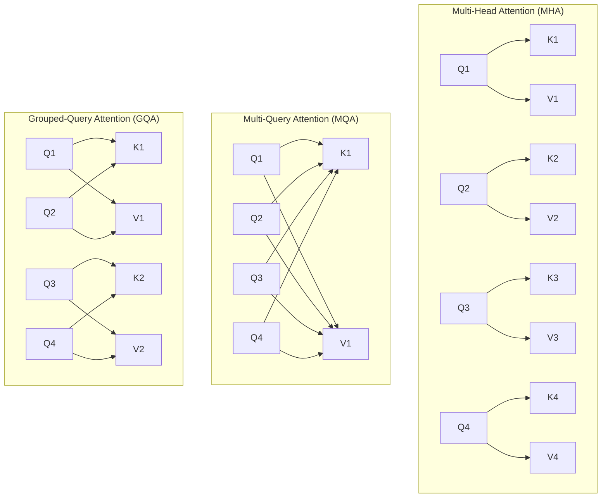
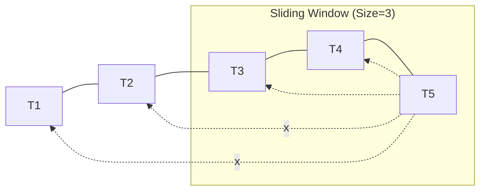

# Attention Mechanisms: MHA, MQA, GQA, MLA, and SWA

The evolution of the "Attention" layer is driven by one goal: **Inference Efficiency**.

---

## 1. Comparing Head Structures

The primary difference between these mechanisms is how they handle the **KV Cache**.



---

## 2. Deep Dive: MHA, MQA, and GQA

### 2.1 MHA (Multi-Head Attention)
*The Original (Attention Is All You Need)*

*   **Mechanism**: Every Query head ($Q$) has its own Key ($K$) and Value ($V$) head.
*   **Problem**: **KV Cache Bloat**. For long sequences, the $K$ and $V$ matrices consume massive memory (Memory Bandwidth Bound).
*   **Formula**: $\text{KV Cache Size} \propto 2 \times \text{layers} \times \text{heads} \times \text{dim} \times \text{seq\_len}$

### 2.2 MQA (Multi-Query Attention)
*The Extreme Optimizer (PaLM, StarCoder)*

*   **Mechanism**: All $Q$ heads share a **single** $K$ and $V$ head.
*   **Pro**: Drastically reduces KV cache size (by $1/\text{heads}$). Massive inference speedup.
*   **Con**: **Quality Drop**. The model loses the ability to distinguish different semantic relationships across different head subspaces simultaneously.

### 2.3 GQA (Grouped-Query Attention)
*The Sweet Spot (Llama-2, Llama-3, Mistral)*

*   **Mechanism**: $Q$ heads are grouped, and each group shares one $K$ and $V$ head.
*   **Llama-3 example**: 32 $Q$ heads, 8 $KV$ groups (4 $Q$ heads per $KV$).
*   **Impact**: Near-MHA quality with near-MQA speed. The industry standard for production serving.

---

## 3. MLA (Multi-Head Latent Attention)
*The DeepSeek-V3 Innovation*

MLA represents the "compression" frontier. Instead of sharing heads, it compresses the entire KV space.

```mermaid
graph LR
    Input[Input Vector] --> Encoder[Down-Projection Matrix]
    Encoder --> Latent[Latent Vector (Compressed)]
    Latent --> DecoderK[K Up-Projection]
    Latent --> DecoderV[V Up-Projection]
    DecoderK --> Keys[Full Resolution Keys]
    DecoderV --> Values[Full Resolution Values]
```

*   **Mechanism**: Low-rank compression of the KV Cache. Instead of storing full $K$ and $V$, it stores a **compressed latent vector** ($d=512$).
*   **The Result**: DeepSeek-V3 achieves **higher throughput than GQA** because its "stored" KV cache is significantly smaller, while its "computed" attention is still high-resolution.

---

## 4. SWA (Sliding Window Attention)
*Handling Infinite Context (Mistral-7B)*



*   **Mechanism**: A token only attends to the last $W$ tokens (the "Window"), rather than the whole context.
*   **Memory Gain**: Constant KV cache size regardless of total sequence length.
*   **Receptive Field**: By stacking $L$ layers, the top layer effectively "sees" $L \times W$ tokens back, creating a large effective context window with local memory costs.

---

## 5. Summary Table

| Mechanism | Ratio (Q:K:V) | Memory Efficiency | Model Example |
|-----------|---------------|-------------------|---------------|
| **MHA** | $H : H : H$ | Baseline (1x) | GPT-3, Llama-1 |
| **MQA** | $H : 1 : 1$ | High (~0.03x) | PaLM, StarCoder |
| **GQA** | $H : G : G$ | Medium (~0.25x) | Llama-3, Mistral |
| **MLA** | Latent | Ultra High | DeepSeek-V3 |

---

## 6. Advanced Q&A

### Q1: "Why is GQA preferred over MQA for 70B+ models?"
> **Answer**: At 70B+ scale, model "intelligence" is the priority. MQA can lead to significant degradation in complex reasoning because all query heads are forced to look at the same Key/Value features. GQA provides enough "KV diversity" (8 heads is common) to maintain dense-model quality while still reducing the KV cache memory traffic bottleneck by 88% (compared to MHA).

### Q2: "How does MLA change the VRAM calculation for a Lead Engineer?"
> **Answer**: In GQA, KV Cache size is `2 * layers * kv_heads * head_dim`. In MLA, the `kv_heads * head_dim` part is replaced by the `latent_dim`. Since the latent dimension (e.g., 512) is much smaller than the sum of all KV heads in a large model, MLA allows you to fit **4-5x more concurrent users** (batch size) in the same VRAM than GQA.

### Q3: "Does SWA prevent the model from remembering the beginning of a book?"
> **Answer**: Technically, a single layer in SWA only sees the window. However, because each layer's window is shifted, information from the beginning of the book "percolates" up through the layers. Layer 1 sees 0-4096, Layer 2 sees the output of Layer 1 (which includes info from 0-4096) plus its own window. This is called **Dilated Receptive Field**.

### Q4: "What is the relationship between Attention mechanisms and vLLM?"
> **Answer**: vLLM's **PagedAttention** is the *implementation* (the memory manager). MHA/GQA/MLA are the *architectures* (the mathematical structure). PagedAttention allows vLLM to store MHA/GQA blocks non-contiguously, which is what actually enables high throughput in production regardless of which attention mechanism the model uses.

### Q5: "If a model uses GQA, does it affect the training speed?"
> **Answer**: Training GQA is actually **more complex** than MHA because you have to manage head grouping during backprop. However, the slightly slower training is a trade-off that is almost always worth it for the massive gains in **Inference Throughput** (2-3x) that GQA provides during the model's production life.
