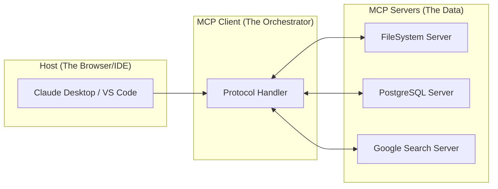

# Model Context Protocol (MCP): The Universal Interface

MCP is an open standard that enables developers to build secure, two-way connections between their data sources and AI-powered tools. Think of it as **USB-C for AI**.

---

## 1. The Core Problem: The "Glue Code" Nightmare
Before MCP, every AI application had to write custom "glue" to connect an LLM to a specific database, API, or local file system.
*   **Problem**: If you have 5 LLMs and 5 data sources, you need 25 custom integrations.
*   **MCP Solution**: A standardized protocol where any **Server** (data/tool) can talk to any **Client** (IDE, Chatbot, Agent).

---

## 2. Architecture: Hosts, Clients, and Servers

### 2.1 The Host
The environment where the AI lives (e.g., Claude Desktop, Cursor, or a custom web app). It manages the UI and the user session.

### 2.2 The Client
The component *inside* the Host that implements the MCP protocol. It maintains connections to multiple servers.

### 2.3 The Server
A lightweight program that exposes three things:
1.  **Resources**: Read-only data (like a file's content or a DB schema).
2.  **Tools**: Executable functions (like `run_query` or `create_file`).
3.  **Prompts**: Template instructions (like "Explain this codebase").

---

## 3. Protocol Primitives (Internal Depth)

### 3.1 JSON-RPC
MCP uses **JSON-RPC 2.0** over standard streams (STDIN/STDOUT) or HTTP/SSE. This makes it language-agnostic.

### 3.2 Capability Negotiation
When a client connects to a server, they exchange "Initialize" messages.
*   "I support sampling (letting the server ask the LLM for help)."
*   "I support roots (giving the server access to local directories)."

### 3.3 The Three Primitives
| Primitive | Purpose | Example |
|-----------|---------|---------|
| **Resources** | Providing Context. | `file:///project/README.md` |
| **Tools** | Taking Action. | `github.create_pull_request(...)` |
| **Prompts** | Guided Interaction. | `debug-python-error` |

---

## 4. Why MCP is a "Lead Level" Topic

As an Architect, you care about MCP for:
1.  **Security**: You can run an MCP server in a local Docker container. The LLM never sees your API keys; it only sends the "Tool Call" to the local server which then executes.
2.  **Decoupling**: You can swap your LLM from Claude to GPT-4o without rewriting your database connectors—as long as they both support MCP.
3.  **Ecosystem**: Instead of building a Jira connector, you just download a community MCP server.

---

## 5. Interview Questions

### Q: "How does MCP improve LLM safety?"
> **Answer**: "MCP introduces a **clean boundary** between reasoning and execution. In a traditional setup, you might give an LLM an API key. With MCP, the API key lives inside the **Server**. The client (LLM) only sends a JSON request to the server. This allows for 'Local Control'—the server can have its own guardrails, rate limits, and permission checks that the LLM cannot bypass via 'jailbreaking'."

### Q: "Explain the difference between an MCP Tool and an MCP Resource."
> **Answer**: "A **Resource** is passive data meant for the LLM to read as context (like a document or a log file). A **Tool** is an active capability that the LLM *calls* to change the state of the world (like sending an email or updating a record). Resources are 'what is it', Tools are 'do this'."

### Q: "Can MCP work over the internet, or is it just for local apps?"
> **Answer**: "It works over both. The standard supports **Transport Layers** including `Stdio` (local processes) and `SSE` (Server-Sent Events over HTTP). This means you can have a centralized MCP server in the cloud that multiple developers connect their IDEs to."
