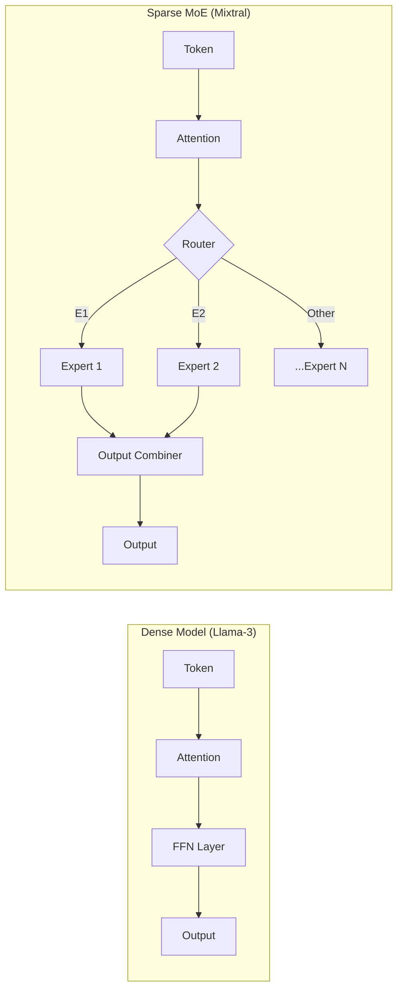
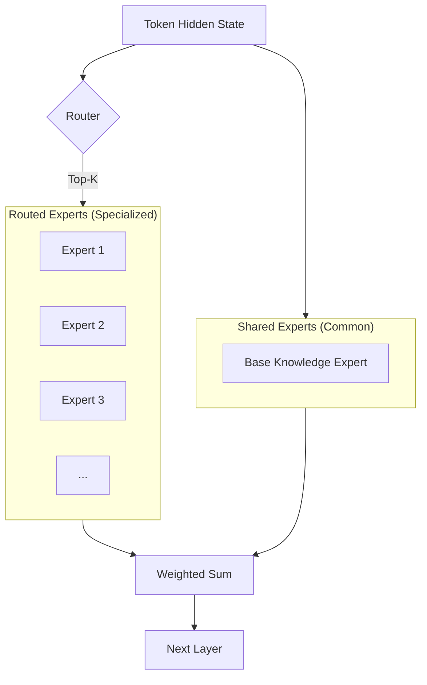

# Mixture of Experts (MoE): Sparse Scaling

MoE is the dominant architecture for ultra-large models (GPT-4, Mixtral, DeepSeek). It allows models to have massive parameter counts while keeping the "Cost-per-Token" low.

---

## 1. Dense vs. Sparse (Visualized)

*   **Dense**: Every token activates every parameter.
*   **Sparse MoE**: A token only activates a small subset ($K$ experts).

---

## 2. Core Components & Routing

### 2.1 The Router (Gating Network)
The Router is the "brain" of the layer. It calculates a probability distribution over all experts.

$$ G(x) = \text{Softmax}(\text{KeepTopK}(H(x), k)) $$

### 2.2 Expert Layers (FFNs)
Each expert is typically an independent Feed-Forward Network.

---

## 3. DeepSeekMoE: The Multi-Head Latent Expert

DeepSeek-V3 introduced a more efficient expert layout to solve the "Knowledge Interference" problem in standard MoE.

---

## 4. Advanced Q&A

### Q1: "What is 'Routing Collapse' and how do you fix it?"
> **Answer**: Routing collapse occurs when the router disproportionately favors a few experts, causing them to receive all the training gradients while others stay "dead". We fix this using an **Auxiliary Balancing Loss** ($L_{aux}$) which penalizes the model if token distribution across experts isn't uniform.

### Q2: "Why is MoE training so memory-intensive?"
> **Answer**: Because even if only 2 experts are active per token, all 8 (or 64) experts must be stored in GPU memory. This requires **Expert Parallelism (EP)**, where different GPUs in a cluster host different experts. The communication overhead of sending tokens between GPUs (all-to-all) becomes the bottleneck.

### Q3: "How does 'Expert Capacity' affect inference?"
> **Answer**: In high-throughput serving, we limit how many tokens a single expert can handle to prevent hardware idle time. If 1000 tokens want Expert 1 but it only has capacity for 500, the remaining 500 are "dropped" (passed through without FFN processing) or sent to a second-best expert. This is the **Capacity Factor**.

### Q4: "Is an 8x7B MoE model exactly the same as a 56B Dense model?"
> **Answer**: No. An 8x7B model (like Mixtral) has ~47B total parameters because the **Attention layers are shared**. Only the FFN layers are multiplied. This is a crucial distinction: MoE scales the *computationally expensive* parts (FFN) while keeping the *inter-token dependency* parts (Attention) efficient.

### Q5: "What is the 'Fine-Grained Experts' strategy in DeepSeek?"
> **Answer**: Standard MoE (Mixtral) uses 8 large experts. DeepSeek uses 64+ tiny experts. This allows the model to be much more surgical. Instead of a whole "Math Expert", it might have 10 tiny experts for different types of sub-equations, leading to higher accuracy for the same total active parameter count.
