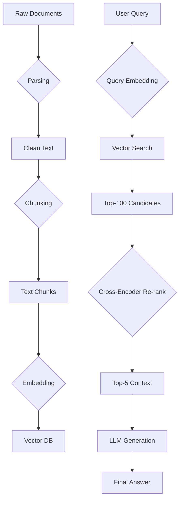

# RAG Pipeline: The Complete Deep Dive

A detailed breakdown of every component in a production-ready Retrieval-Augmented Generation (RAG) pipeline, from document ingestion to final answer synthesis.

---

## 1. Document Ingestion & Parsing

### The Goal
Convert unstructured data (PDFs, DOCX, HTML) into clean, chunkable text.

### Tools & Techniques
| Source Type | Parser | Notes |
|-------------|--------|-------|
| **PDF** | `pdfplumber`, `PyMuPDF` | Handle tables, multi-column layouts. |
| **DOCX** | `python-docx` | Extract text, headers, and metadata. |
| **HTML** | `BeautifulSoup`, `trafilatura` | Remove boilerplate (ads, navbars). |
| **Scanned Docs** | `Tesseract OCR`, `Marker` | For image-based PDFs. |

### Lead-Level Insight
> "Parsing is where most RAG pipelines fail silently. If a table is parsed as a jumbled sentence, no amount of LLM magic will fix it. I invest heavily in parsing validation—spot-checking 50 random documents before scaling."

---

## 2. Chunking Strategies

### Why Chunk?
LLMs have context limits (4K-128K tokens). Embeddings also work better on focused, self-contained text blocks.

### Strategies
| Strategy | How It Works | When to Use |
|----------|--------------|-------------|
| **Fixed Size** | Split every N tokens/characters. | Simple, fast baseline. |
| **Sentence-Based** | Split on sentence boundaries (`.`, `!`, `?`). | Easy to implement. |
| **Semantic** | Split where embedding similarity drops. | Best quality, slower. |
| **Recursive** | Try large chunks, then split if too big. | Good for varied doc lengths. |

### Best Practice: Overlap
> "I always use a 10-20% overlap between chunks. If a key fact is split across a boundary, the overlap ensures at least one chunk contains the full context."

---

## 3. Embedding Models

### The Goal
Convert text into a dense vector (e.g., 768 or 1536 dimensions) that captures semantic meaning.

### Popular Models
| Model | Dimensions | MTEB Rank | Speed |
|-------|------------|-----------|-------|
| `text-embedding-3-large` (OpenAI) | 3072 | Very High | API-bound |
| `bge-base-en-v1.5` | 768 | High | Fast (local) |
| `nomic-embed-text` | 768 | High | Fast (Ollama) |
| `e5-mistral-7b-instruct` | 4096 | Very High | Slow (GPU needed) |

### Lead-Level Insight
> "I benchmark embeddings on *my* data, not just MTEB. A model might rank #1 globally but fail on financial jargon. I create a 'golden set' of 100 query-document pairs and measure Recall@10."

---

## 4. Vector Databases

### The Goal
Store embeddings and enable fast Approximate Nearest Neighbor (ANN) search.

### Database Comparison
| Database | Scaling | Key Feature | Best For |
|----------|---------|-------------|----------|
| **ChromaDB** | Single Node | Simplicity | Prototypes, <100K docs |
| **Milvus** | Distributed | IVF_PQ, Sharding | Production, Millions of docs |
| **Qdrant** | Distributed | Payload filtering | Hybrid search |
| **Pinecone** | Managed | Serverless | Teams without infra engineers |
| **Weaviate** | Distributed | GraphQL API | Hybrid semantic+keyword |

### Key Indexing Concepts
*   **IVF (Inverted File)**: Clusters vectors. Searches only nearby clusters.
*   **PQ (Product Quantization)**: Compresses vectors to save memory.
*   **HNSW (Hierarchical NSW)**: Graph-based. Faster search, more memory.

---

## 5. Retrieval: Dense, Sparse & Hybrid

### Dense Retrieval
Uses vector similarity (cosine, dot product). Captures *semantic* meaning.
> "What is the company's financial health?" finds chunks about solvency, liquidity, debt.

### Sparse Retrieval (BM25)
Uses keyword matching (TF-IDF based). Captures *exact* terms.
> "10-K filing Apple 2024" finds exact matches.

### Hybrid Retrieval (The Answer)
Combine both. Use **Reciprocal Rank Fusion (RRF)** to merge results:
```
RRF_score(doc) = Σ 1 / (k + rank_in_list)
```
where `k` is a constant (typically 60).

---

## 6. Re-Ranking with Cross-Encoders

### Why Re-rank?
Vector search is fast but approximate. A Cross-Encoder is slower but more accurate because it analyzes the query AND the document together.

### The Process
1.  Retrieve Top-100 candidates via vector search.
2.  Pass each `(query, document)` pair through the Cross-Encoder.
3.  Re-sort by the Cross-Encoder's relevance score.
4.  Keep Top-5 for the LLM.

### Models
*   `cross-encoder/ms-marco-MiniLM-L-6-v2` (Fast, CPU-friendly)
*   `BAAI/bge-reranker-large` (Slower, Higher quality)

---

## 7. LLM Generation & Serving

### The Prompt Structure
```
System: You are a financial analyst assistant. Answer based ONLY on the provided context.

Context:
{chunk_1}
{chunk_2}
...

User: {query}
```

### Serving Options
| Framework | Key Feature | Use Case |
|-----------|-------------|----------|
| **vLLM** | PagedAttention, Continuous Batching | High throughput serving |
| **Triton** | Multi-model, GPU sharing | Enterprise deployments |
| **TGI (HuggingFace)** | Easy Docker deploy | Quick start |
| **Ollama** | Local, simple API | Local dev / edge |

---

## 8. Evaluation (RAGAS)

| Metric | What It Measures | Good Score |
|--------|------------------|------------|
| **Faithfulness** | Is the answer grounded in the context? | > 0.9 |
| **Answer Relevancy** | Does the answer address the question? | > 0.85 |
| **Context Precision** | Are the retrieved chunks useful? | > 0.7 |
| **Context Recall** | Did we retrieve all needed info? | > 0.8 |

---

## 9. The Complete Flow (Mermaid Diagram)



---

## 10. Common Pitfalls & Fixes

| Pitfall | Symptom | Fix |
|---------|---------|-----|
| **Bad Parsing** | Answers cite garbage text | Validate parsing on 50 random docs |
| **Chunks Too Big** | Irrelevant context dilutes answer | Reduce chunk size, add overlap |
| **Wrong Embedding** | Low Recall@10 on golden set | Benchmark on your domain data |
| **No Re-ranking** | High-ranked docs are off-topic | Add Cross-Encoder stage |
| **Hallucination** | Answer not in context | Add "only use context" instruction |
