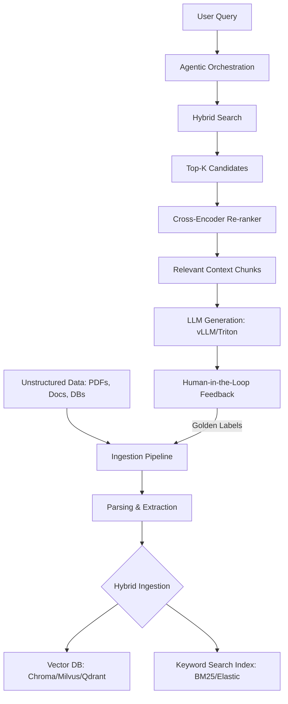

# Enterprise RAG System Design

This guide outlines the architecture for a scalable, production-ready Retrieval-Augmented Generation (RAG) system, optimized for sub-2-second latency and millions of documents.

---

## 1. High-Level Architecture

---

## 2. Component Deep-Dive

### 2.1 The Ingestion Pipeline
- **Parallel Processing**: Using Apache Spark or Kafka to handle thousands of documents per minute.
- **Smart Chunking**: Instead of fixed-length tokens, use **Semantic Chunking**. Split text where the meaning shifts (using sliding windows or embedding similarity).
- **Metadata Enrichment**: Tag chunks with document ID, page number, and source author to enable better filtering.

### 2.2 Semantic Search & Hybrid Retrieval
- **Dense Retrieval**: Captures semantic intent ("What is the solvency ratio?"). Use BGE-Base or Nomic embeddings.
- **Sparse Retrieval**: Captures exact keywords ("Apple Inc 2024"). Necessary for financial and medical precision.
- **RRF (Reciprocal Rank Fusion)**: A weight-free algorithm to merge results from Dense and Sparse indices.

### 2.3 Precision Re-ranking
Retrieval often returns "noisy" results. We use a **Cross-Encoder** as a second stage.
- **The Process**: Take the top 100 results and the query. Pass them through a model that looks at $Q+D$ simultaneously. Output a high-precision score (0 to 1).
- **Latency Tip**: Keep the Top-K small (100) as Cross-Encoders are slower than Bi-Encoders.

---

## 3. Serving & Optimization

### ⚡ Sub-2-Second Latency Blueprint
1.  **Semantic Caching (Redis/GPTCache)**: Store and retrieve common queries/embeddings to avoid LLM calls.
2.  **vLLM (PagedAttention)**: Use dedicated inference servers to handle concurrent users without memory fragmentation.
3.  **Quantization (AWQ/FP8)**: Shrink models to fit in less VRAM while maintaining 99% accuracy.

### 🛡️ Evaluation Metrics (RAGAS)
- **Faithfulness**: Is the answer derived *only* from the context? (Prevents hallucinations).
- **Answer Relevancy**: Does the answer address the question?
- **Context Precision**: Out of all retrieved chunks, how many were actually used?

---

## 4. Human-In-The-Loop (HITL)
In production, models will make mistakes.
- **Correction Queue**: Allow subject matter experts to edit the generated reports.
- **The Flywheel**: These edits become "Golden Triples" (Query + Context + Correction). Use these for **DPO (Direct Preference Optimization)** fine-tuning of the core model.
